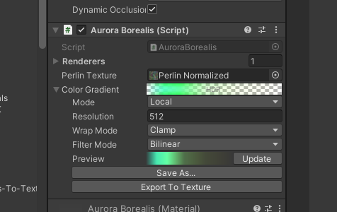

[](http://roytheunissen.com)
[](LICENSE.md)
 

_Contains utilities for defining a curve or gradient in the inspector and automatically generating a texture for that to pass on to shaders._

## About the Project

Sometimes you're working on a shader and you really need to finesse the curve of certain values, or perhaps some kind of colour gradient. Very quickly you'll grab your image processing application of choice and whip up a nice texture file. This workflow is tedious though. Make a new texture, tweak the values, press CTRL+S, switch back to Unity, wait for it to import, and _then_ you see your results. There is an inherent separation between making the texture and seeing the end result.

To cut down on iteration time you would ideally just tweak a curve or gradient in the Inspector and see it apply to your shader in real-time.

But surely it would be very tedious to make such a utility? Yes it was. I hope it can be of some use to you.

<!-- [TO DO Video](https://www.youtube.com/watch?v=dQw4w9WgXcQ)    |    [TO DO Article](https://blog.roytheunissen.com) -->


## Getting Started

- Add an `AnimationCurveTexture` or `GradientTexture` field to your script
- Send it to a shader via a `MaterialPropertyBlock` or Global Shader Property by accessing its `Texture` property.
- Tweak the values by generating a new texture for this field (Local Mode) or from a re-usable Animation Curve Asset.
    - I recommend just working in Local mode, and once you're happy with the values, saving it to an Asset or a Texture.
- See the result of your changes in real-time and approach the optimal values faster.



## Compatibility

It has been tested in 2021.3.2f1, but as far as I know it's not dependent on any 2021-specific features and will work in older versions, too.

## Installation

### Package Manager

Go to `Edit > Project Settings > Package Manager`. Under 'Scoped Registries' make sure there is an OpenUPM entry.

If you don't have one: click the `+` button and enter the following values:

- Name: `OpenUPM` <br />
- URL: `https://package.openupm.com` <br />

Then under 'Scope(s)' press the `+` button and add `com.roytheunissen`.

It should look something like this: <br />


<br />
All of my packages will now be available to you in the Package Manager in the 'My Registries' section and can be installed from there.
<br />


### Git Submodule

You can check out this repository as a submodule into your project's Assets folder. This is recommended if you intend to contribute to the repository yourself.

### OpenUPM
The package is available on the [openupm registry](https://openupm.com). It's recommended to install it via [openupm-cli](https://github.com/openupm/openupm-cli).

```
openupm add com.roytheunissen.curvesandgradientstotexture
```

### Manifest
You can also install via git URL by adding this entry in your **manifest.json**

```
"com.roytheunissen.curvesandgradientstotexture": "https://github.com/RoyTheunissen/Curves-And-Gradients-To-Texture.git"
```

### Unity Package Manager
```
from Window->Package Manager, click on the + sign and Add from git: https://github.com/RoyTheunissen/Curves-And-Gradients-To-Texture.git
```


## Contact
[Roy Theunissen](https://roytheunissen.com)

[roy.theunissen@live.nl](mailto:roy.theunissen@live.nl)
