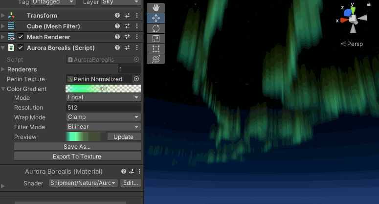

[](http://roytheunissen.com)
[](LICENSE.md)
 

_🛑 <b><u>TO DO</u></b>_

## About the Project

🛑 <b><u>TO DO</u></b>

[TO DO Video](https://www.youtube.com/watch?v=dQw4w9WgXcQ)    |    [TO DO Article](https://blog.roytheunissen.com)



## Getting Started

- 🛑 <b><u>TO DO</u></b>

## Compatibility

🛑 <b><u>TO DO</u></b>

## Installation

### Package Manager

Go to `Edit > Project Settings > Package Manager`. Under 'Scoped Registries' make sure there is an OpenUPM entry.

If you don't have one: click the `+` button and enter the following values:

- Name: `OpenUPM` <br />
- URL: `https://package.openupm.com` <br />

Then under 'Scope(s)' press the `+` button and add `com.roytheunissen`.

It should look something like this: <br />


<br />
All of my packages will now be available to you in the Package Manager in the 'My Registries' section and can be installed from there.
<br />


### Git Submodule

You can check out this repository as a submodule into your project's Assets folder. This is recommended if you intend to contribute to the repository yourself.

### OpenUPM
The package is available on the [openupm registry](https://openupm.com). It's recommended to install it via [openupm-cli](https://github.com/openupm/openupm-cli).

🛑 <b><u>TO DO</u></b>
```
openupm add com.roytheunissen.assetpalette
```

### Manifest
You can also install via git URL by adding this entry in your **manifest.json**

🛑 <b><u>TO DO</u></b>
```
"com.roytheunissen.assetpalette": "https://github.com/RoyTheunissen/Asset-Palette.git"
```

### Unity Package Manager
🛑 <b><u>TO DO</u></b>
```
from Window->Package Manager, click on the + sign and Add from git: https://github.com/RoyTheunissen/Asset-Palette.git
```


## Contact
[Roy Theunissen](https://roytheunissen.com)

[roy.theunissen@live.nl](mailto:roy.theunissen@live.nl)
